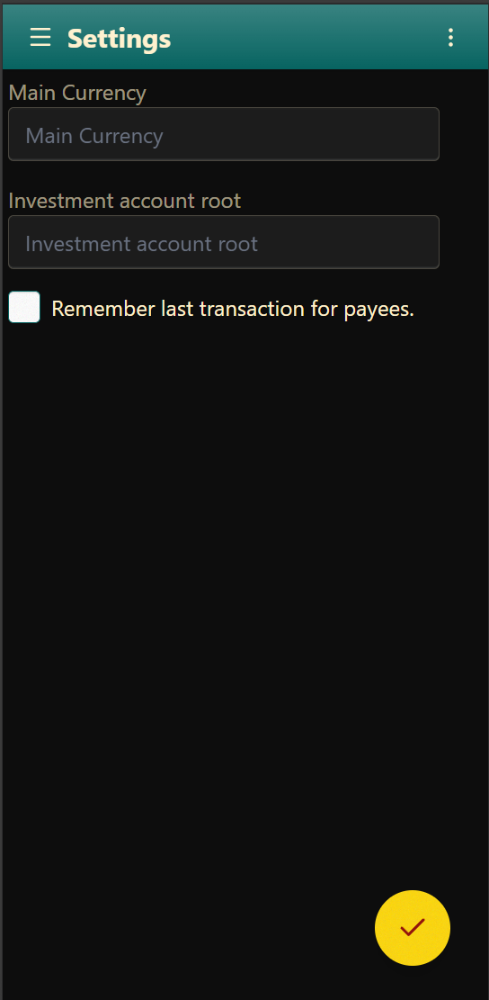

# Settings

The Settings page is used to configure various application options and customizations.

- Set the Main Currency.
- Set the Investment account root, i.e. `Asset:Investments`.
- Choose whether to remember the last entered transaction for a payee, for quick retrieval later.

## Restore

If you have backed up your settings previously, you can restore them in the [Backup](backup.md) screen.
